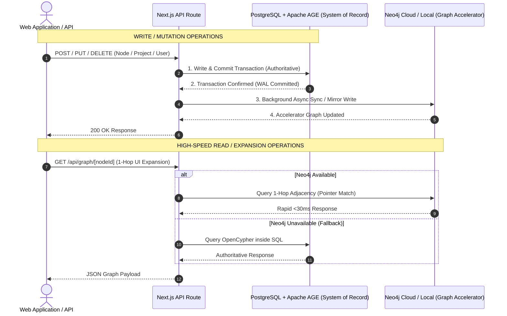

# Hybrid Database Architecture & Selection Policy
## System of Record (PostgreSQL + Apache AGE) vs. Specialized Graph Acceleration (Neo4j)

---

## 1. Executive Summary & Core Directive

In accordance with system reliability standards and infrastructure cost controls, the application architecture follows a **Hybrid Multi-Model Strategy**:

```
┌─────────────────────────────────────────────────────────────────────────────────────────────┐
│                                SYSTEM ARCHITECTURE DIRECTIVE                                │
├──────────────────────────────────────────────┬──────────────────────────────────────────────┤
│       PRIMARY SYSTEM OF RECORD (90%)         │      SPECIALIZED GRAPH ACCELERATOR (10%)     │
│                                              │                                              │
│          POSTGRESQL + APACHE AGE             │                    NEO4J                     │
│  (Relational + OpenCypher Graph Engine)      │       (Native Index-Free Adjacency)          │
│                                              │                                              │
│ • Authoritative persistence & transaction    │ • High-frequency interactive 1-hop UI        │
│ • User CRUD, Project CRUD, Asset properties  │ • Real-time point-to-point path exploration  │
│ • 100% Free & Open-Source (No license caps)  │ • Scoped execution to avoid Enterprise cost  │
└──────────────────────────────────────────────┴──────────────────────────────────────────────┘
```

> **Mandatory Policy Directive:**
> 1. **PostgreSQL + Apache AGE** is the **Primary System of Record** and must drive and save all application state, projects, users, relational schemas, asset metadata, and core graph topology.
> 2. **Neo4j DB** is utilized **on-demand as a specialized graph accelerator** for complex, latency-sensitive graph operations (such as real-time 1-hop UI graph expansions and deep path exploration).
> 3. General persistent storage, user tables, and multi-tenant project management must never be locked behind proprietary Neo4j Enterprise licenses.

---

## 2. Why We Use PostgreSQL + Apache AGE as Primary

### 2.1 Licensing & Reliability Advantages
- **Zero Licensing Overhead:** Apache AGE is an official Apache Software Foundation project that runs as an extension inside standard PostgreSQL. Features like multi-tenancy, high-availability replication, automated backups, and fine-grained security are **100% free** via standard PostgreSQL tools (pg_dump, WAL streaming, Patroni).
- **Full ACID Reliability:** Every graph node and edge creation in Apache AGE shares PostgreSQL’s write-ahead log (WAL) and transactional guarantees.
- **Relational + Graph Hybrid Queries:** Allows joining relational user accounts and project metadata with graph topologies in a single SQL query using `agtype`.

### 2.2 Why Neo4j is Used Selectively
- **Index-Free Adjacency:** Neo4j stores memory pointers directly inside node records. For **interactive 1-hop UI expansions** in the React layout engine, Neo4j resolves pointer references at **$O(1)$ constant time per hop**, yielding 20x+ latency speedups over relational set-joins.
- **Enterprise Feature Avoidance:** Neo4j Enterprise edition charges per CPU core for advanced clustering, fine-grained RBAC, and multi-database support. By storing core data in PostgreSQL + AGE and using Neo4j strictly as a read-heavy query cache/accelerator, we eliminate licensing risks.

---

## 3. Database Selection & Workload Routing Matrix

Refer to the following decision matrix when designing new features or API endpoints:

| Application Workload / Feature | Primary Database | Routing Rationale |
|---|---|---|
| **User Management & Auth** | **PostgreSQL + AGE** | Relational user schemas, role-based access, password hashes, session tables. |
| **Project CRUD & Metadata** | **PostgreSQL + AGE** | 1-to-1 and 1-to-N project metadata (`name`, `deadline`, `description`). |
| **Asset Knowledge Base Catalog** | **PostgreSQL + AGE** | Full relational property storage for 1,257+ asset entities and metadata. |
| **Multi-Hop Set Joins & Reports** | **PostgreSQL + AGE** | Subgraph set-joins and reporting leverage PostgreSQL's query optimizer. |
| **Interactive 1-Hop UI Expansions** | **Neo4j** | Native index-free adjacency pointers expand neighbor nodes in <30ms. |
| **Deep Pathfinding & Reachability** | **Neo4j** | Real-time interactive point-to-point shortest path exploration. |
| **Backup, Restore & Disaster Recovery**| **PostgreSQL + AGE** | Single unified `pg_dump` snapshot backs up relational data and graph topologies. |

---

## 4. Architectural Data Synchronization Flow

To maintain **100% data parity** between the PostgreSQL system of record and the Neo4j graph accelerator:



---

## 5. Implementation Code Reference

### 5.1 System of Record Write (PostgreSQL + Apache AGE)
Executing OpenCypher inside PostgreSQL via `lib/age.ts`:

```typescript
import { runAgeQuery } from '@/lib/age';

// Authoritative creation of a Security Node inside Apache AGE
export async function createEntityInAGE(id: string, label: string, kind: string) {
  const cypher = `
    CREATE (n:Entity {id: '${id}', label: '${label}', kind: '${kind}'})
    RETURN n
  `;
  return await runAgeQuery(cypher, 'n agtype');
}
```

### 5.2 Accelerated Graph Read (Neo4j Fallback Routing)
Querying with automatic fallback via `app/api/graph/all/route.ts`:

```typescript
import { isAgeConfigured, runAgeQuery } from '@/lib/age';
import { isNeo4jConfigured, runQuery as runNeo4jQuery } from '@/lib/neo4j';

export async function getGraphData() {
  // 1. Primary System of Record: PostgreSQL + Apache AGE
  if (isAgeConfigured()) {
    try {
      const nodes = await runAgeQuery(`MATCH (n:Entity) RETURN n`, `n agtype`);
      const edges = await runAgeQuery(`MATCH (a:Entity)-[r]->(b:Entity) RETURN a.id, b.id, type(r)`, `source agtype, target agtype, relType agtype`);
      return { nodes, edges, source: 'postgresql-apache-age' };
    } catch (err) {
      console.warn('AGE query fallback to Neo4j accelerator');
    }
  }

  // 2. Specialized Accelerator: Neo4j
  if (isNeo4jConfigured()) {
    const nodes = await runNeo4jQuery(`MATCH (n:Entity) RETURN n.id AS id, n.label AS label, n.kind AS kind`);
    const edges = await runNeo4jQuery(`MATCH (a:Entity)-[r]->(b:Entity) RETURN a.id AS source, b.id AS target, type(r) AS relType`);
    return { nodes, edges, source: 'neo4j-accelerator' };
  }
}
```

---

## 6. Summary Rules for Development Teams

1. **Always write to PostgreSQL + Apache AGE first.** Never create a user, project, or asset entry strictly inside Neo4j without persisting it to PostgreSQL.
2. **Use OpenCypher standard syntax.** Avoid engine-proprietary vendor syntax so queries run seamlessly on both Apache AGE and Neo4j.
3. **Treat Neo4j as disposable cache.** The application must be capable of rebuilding the Neo4j graph at any time from the PostgreSQL system of record using `scripts/seed-massive.ts`.
4. **Keep backup scripts unified.** Database disaster recovery procedures strictly mandate backing up PostgreSQL (`pg_dump`), which includes all relational tables and `ag_catalog` graph partitions.
